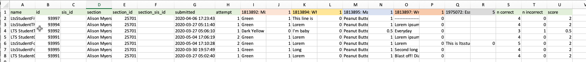

# Canvas Quiz Student Analysis Reformatting

> - name: canvas-student-analysis-reformatting
> - python>=3.7

## Summary

__Canvas Quiz Student Analysis Reformatting__ is a python script that will reformat any Canvas Quiz Student Analysis export from "wide" to "long" format.  

---

## Inputs

- any csv file in `quiz_student_analysis_file`
  > note: if there are multiple csvs in this file they will be combined into a single output
  > see "sample.csv"

- the input file must include all columns in the original export (green), as well as the questions from that quiz (multi colours) 

## Output

### originalfilename_long_format.csv:
> see "sample_long_format.csv"
_The long format of the given csv(s) in the input folder._

- **name:** student name
- **id:** student Canvas id
- **sis_id:** student sis id
- **section:** Canvas section
- **section_id:** Canvas section id
- **submitted:** timestamp of submission (UTC)
- **attempt:** the attempt of the submission
- **question:** the original question text
- **response:** the original student response
- **possible_points:** the points available for the question
- **points_id:** remains from the wide to long transformation
- **question_id:** the question id
- **points_given:** the given points for the question for the student
- **file_name:** the filename (useful when including multiple quiz exports)

## Getting Started
**Note** this project should only need to install pandas, so you can skip the environment setup if you are comfortable, as long as you have python3+ and pandas installed. In this case all you need to do is 

1. make sure you are in the project directory
2. add your file(s) to quiz_student_analysis_file
3. run 
> `$ python transform_quizzes.py`
### General (terminal instructions)

> Project uses **conda** to manage environment (See official **conda** documentation [here](https://docs.conda.io/projects/conda/en/latest/user-guide/tasks/manage-environments.html#creating-an-environment-from-an-environment-yml-file))

#### First Time

1. Ensure you have [conda](https://docs.conda.io/projects/conda/en/latest/user-guide/install/index.html) installed (Python 3.7+ version)
1. Clone **canvas-student-analysis-reformatting** repository
1. Import environment (once): `$ conda env create -f environment.yml`

#### Every Time

1. Run
   1. `$ conda activate canvas-student-analysis-reformatting`
   1. `python transform_quizzes.py`

---

_authors: @alisonmyers_
